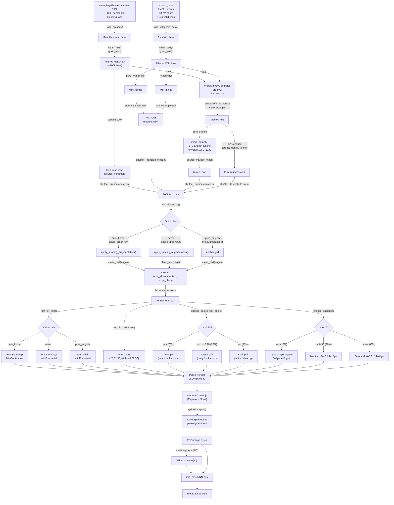

# Dataset Generation: Complete Technical Reference
## Siemreap / Arial 200k OCR Corpus

> **Entry point**: [`scripts/generate_200k_siemreap_arial.py`](file:///home/kimkosal-y/yk-projects/training-ocr/scripts/generate_200k_siemreap_arial.py)  
> **Text helpers**: [`scripts/generate_text.py`](file:///home/kimkosal-y/yk-projects/training-ocr/scripts/generate_text.py) · [`scripts/generate.py`](file:///home/kimkosal-y/yk-projects/training-ocr/scripts/generate.py)  
> **Renderer**: [`renderer/server.js`](file:///home/kimkosal-y/yk-projects/training-ocr/renderer/server.js)

---

## Table of Contents
1. [Architecture Overview](#1-architecture-overview)
2. [Corpus Sources](#2-corpus-sources)
   - 2.1 [Hanuman Dataset](#21-hanuman-dataset)
   - 2.2 [Khmer Wikipedia Corpus](#22-khmer-wikipedia-corpus)
3. [Text Generation Pipeline](#3-text-generation-pipeline)
   - 3.1 [Sampling Budget](#31-sampling-budget)
   - 3.2 [Text Cleaning](#32-text-cleaning)
   - 3.3 [Text Validation](#33-text-validation)
   - 3.4 [Script Classification](#34-script-classification)
4. [Word Markov Generator](#4-word-markov-generator)
   - 4.1 [Training Phase](#41-training-phase)
   - 4.2 [Inference Phase](#42-inference-phase)
   - 4.3 [English Injection](#43-english-injection)
5. [Spacing Augmentation](#5-spacing-augmentation)
6. [Image Rendering Pipeline](#6-image-rendering-pipeline)
   - 6.1 [Font Routing](#61-font-routing)
   - 6.2 [Font Size Sampling](#62-font-size-sampling)
   - 6.3 [Color Variation](#63-color-variation)
   - 6.4 [Padding Variation](#64-padding-variation)
   - 6.5 [Renderer Architecture](#65-renderer-architecture)
7. [Parallelism and Idempotency](#7-parallelism-and-idempotency)
8. [Output Artifacts](#8-output-artifacts)
9. [Full Data Flow Diagram](#9-full-data-flow-diagram)
10. [CLI Reference](#10-cli-reference)

---

## 1. Architecture Overview

The pipeline runs in two phases that can be executed independently:

| Phase | Flag | Description |
|---|---|---|
| **Text phase** | (always runs) | Build and clean 200k text rows, write `labels.csv` |
| **Render phase** | omit `--texts-only` | Send each row to the renderer, write PNG + `metadata.duckdb` |

Both phases are deterministic given the same `--seed`. Per-image randomness uses `random.Random(seed + idx)` so worker order does not affect output.

---

## 2. Corpus Sources

### 2.1 Hanuman Dataset

| Property | Value |
|---|---|
| HuggingFace repo | `seanghay/khmer-hanuman-100k` |
| Split used | `train` |
| Approximate size | ~100,000 Khmer sentences |
| Language | Pure Khmer prose |
| Content | General-domain Khmer text (news, literature, mixed domain) |
| Target share in 200k | **50%** (100,000 rows) |

The dataset is loaded with `datasets.load_dataset(...)` and every line is immediately passed through `clean_text` + `good_text` filtering before being stored. After filtering the surviving lines are random-sampled (without replacement) up to the 100k target. Any deficit is filled with sampling with replacement (`hanuman_fill` source tag).

### 2.2 Khmer Wikipedia Corpus

| Property | Value |
|---|---|
| Location | `kmwiki_data/` (local directory) |
| Total `.txt` files | **2,482 files** |
| Total characters | **~43.7 million** |
| Valid lines (≥ 10 chars) | **~104,000 lines** |
| Largest single file | ~519 KB |
| Median file size | ~5.4 KB |

The corpus covers an extraordinarily wide range of topics written in Khmer, including:

**Cambodian history & culture**
- Angkor Empire, Chenla, colonial period, Khmer Rouge era
- Cambodian provinces (all 25 provinces documented individually)
- Cambodian communes and districts
- Traditional music, dance, customs

**Buddhism & religion**
- Pali canon texts (Tipitaka, individual suttas)
- Buddhist teachings and commentaries
- Dhamma texts in Khmer translation

**Science & technology**
- Computer science (HTML, Linux/KDE, Ubuntu, MySQL)
- Medical topics (diseases, parasitology, anatomy)
- Physics, mathematics, chemistry

**International topics**
- Biographies (world leaders, athletes, musicians)
- World Cup, Super Bowl, K-pop (BTS, T-ARA)
- Countries and international organizations

**Law & governance**
- Cambodian legal codes (full text)
- Electoral law, family law, drug control law
- Local governance structures

**Literature & classical texts**
- ចន្ទរាជា (639 KB — largest article, a classic Khmer novel)
- Historical chronicles, folktales

Files are loaded by [`load_wikipedia_data`](file:///home/kimkosal-y/yk-projects/training-ocr/scripts/generate_text.py#L83-L99):

```python
def load_wikipedia_data(data_dir: str = "kmwiki_data") -> list[str]:
    lines = []
    for fname in os.listdir(data_dir):
        if not fname.endswith(".txt"):
            continue
        fpath = os.path.join(data_dir, fname)
        with open(fpath, encoding="utf-8") as f:
            for line in f:
                line = line.strip()
                if len(line) >= 10:
                    lines.append(line)
    return lines
```

After cleaning and filtering, wiki lines are split by script class:
- `wiki_khmer`: pure Khmer lines → pooled into the wiki sample
- `wiki_mixed`: Khmer + Latin lines → pooled into the wiki sample
- `pure_english` lines are discarded (not part of the 200k target)

---

## 3. Text Generation Pipeline

### 3.1 Sampling Budget

```
Total target: count (default 200,000)

hanuman_target   = count // 2           = 100,000
contextual_target = count - hanuman_target = 100,000

  wiki_target   = contextual_target // 2          = 50,000
  markov_target = contextual_target - wiki_target  = 50,000
```

Fill order when primary targets can't be met:
1. Top up Hanuman from `hanuman_lines` with replacement (`hanuman_fill`)
2. Top up remainder from Markov generation (`markov_khmer_fill` / `markov_mixed_fill`)

Source tags stored in metadata:

| Source tag | Meaning |
|---|---|
| `hanuman` | Primary Hanuman sample |
| `wiki` | Wikipedia sample (khmer or mixed) |
| `markov_khmer` | Markov-generated pure Khmer |
| `markov_mixed` | Markov with English injection (18% of Markov) |
| `hanuman_fill` | Hanuman with replacement to reach target |
| `markov_khmer_fill` | Markov fill for deficit |
| `markov_mixed_fill` | Markov mixed fill for deficit |

### 3.2 Text Cleaning

Every raw line is cleaned by [`clean_text`](file:///home/kimkosal-y/yk-projects/training-ocr/scripts/generate_200k_siemreap_arial.py#L55-L65) which applies two layers:

#### Layer 1 — Character allowlist

Characters are kept if they fall into any of these categories:

| Category | Unicode range / description |
|---|---|
| Khmer base | `U+1780–U+17FF` (all Khmer script) |
| Khmer supplemental | `U+19E0–U+19FF` (Khmer symbols) |
| Printable ASCII | `U+0020–U+007E` (space through tilde) |
| Zero-width space | `U+200B` |
| Curly quotes | `"` `"` `'` `'` (`U+201C/D`, `U+2018/9`) |
| Dashes | `–` `—` (`U+2013`, `U+2014`) |
| Ellipsis | `…` (`U+2026`) |
| Guillemets | `«` `»` (`U+00AB`, `U+00BB`) |
| Khmer currency | `៛` (`U+17DB`) |
| Degree symbol | `°` (`U+00B0`) |

All other characters are **silently dropped**.

Whitespace is then collapsed: `re.sub(r"\s+", " ", text).strip()`.

#### Layer 2 — Khmer script sanitization (`sanitize_khmer_text`)

Applied via [`sanitize_khmer_text`](file:///home/kimkosal-y/yk-projects/training-ocr/scripts/generate.py#L25-L59), which fixes malformed Khmer Unicode sequences that would cause rendering anomalies (dotted circles, stacked vowels):

**Step 1** — Deduplicate consecutive Coeng signs
```python
text = re.sub(r'\u17d2+', '\u17d2', text)
# ្្ → ្
```

**Step 2** — Deduplicate consecutive vowels (`U+17B6–U+17C5`)
```python
text = re.sub(r'([\u17b6-\u17c5])\1+', r'\1', text)
# ារ → ា  (when duplicated)
```

**Step 3** — Deduplicate consecutive diacritics (`U+17C6–U+17D1`, `U+17D3`)
```python
text = re.sub(r'([\u17c6-\u17d1\u17d3])\1+', r'\1', text)
```

**Step 4** — Remove floating Coengs (Coeng not followed by `U+1780–U+17A2` consonant)
```python
text = re.sub(r'\u17d2(?![ក-អ])', '', text)
# Removes ្ at end-of-string, before space, before punctuation
```

**Step 5** — Remove floating vowels/diacritics at string start or after whitespace
```python
text = re.sub(r'(^|\s)[\u17b6-\u17d3]+', r'\1', text)
```

**Step 6** — Remove PUA characters (rendering artifacts)
```python
text = re.sub(r'[\ue000-\uf8ff]', '', text)
```

**Step 7** — Fix boundary spacing between scripts
```python
text = re.sub(r'([a-z])([A-Z])', r'\1 \2', text)          # camelCase → camel Case
text = re.sub(r'([A-Za-z])([\u1780-\u17ff])', r'\1 \2', text)  # Latin→Khmer boundary
text = re.sub(r'([\u1780-\u17ff])([A-Za-z])', r'\1 \2', text)  # Khmer→Latin boundary
text = re.sub(r'\s+', ' ', text)
```

**Step 8** — Strip trailing Coeng (loop until none remain)
```python
while text.endswith('\u17d2'):
    text = text[:-1].strip()
```

### 3.3 Text Validation

After cleaning, each line is accepted only if **all** of the following pass:

```python
def good_text(text: str, min_len: int, max_len: int) -> bool:
    if not (min_len <= len(text) <= max_len):
        return False
    if not ALLOWED_RE.match(text):
        return False
    return bool(KHMER_RE.search(text) or LATIN_RE.search(text))
```

| Rule | Default value | Reason |
|---|---|---|
| Minimum length | **10 characters** | Avoid single-char or trivially short labels |
| Maximum length | **200 characters** | Avoid text wider than the model's sequence limit |
| Must match `ALLOWED_RE` | see below | Whitelist filter — rejects lines with unclean characters |
| Must contain Khmer **or** Latin | required | Rejects digit-only or symbol-only lines |

**ALLOWED_RE** (the complete whitelist):
```
^[\u1780-\u17FF\u19E0-\u19FFa-zA-Z0-9\s
.,;:!?()\[\]{}_+\-*/=%$@&#|\\~<>\"'
\u201c\u201d\u2018\u2019\u2013\u2014\u2026\u00ab\u00bb\u17db\u00b0\u200b
]+$
```

### 3.4 Script Classification

Every row is tagged with a `script_class` used downstream for font selection and spacing augmentation:

```python
KHMER_RE  = re.compile(r"[\u1780-\u17ff\u19e0-\u19ff]")
LATIN_RE  = re.compile(r"[A-Za-z]")

def classify_script(text: str) -> str:
    has_khmer = bool(KHMER_RE.search(text))
    has_latin = bool(LATIN_RE.search(text))
    if has_khmer and has_latin: return "mixed"
    if has_khmer:               return "pure_khmer"
    if has_latin:               return "pure_english"
    return "pure_khmer"   # fallback for digit/symbol-only (rare)
```

---

## 4. Word Markov Generator

The [`WordMarkovGenerator`](file:///home/kimkosal-y/yk-projects/training-ocr/scripts/generate_text.py#L10-L47) builds a word-level n-gram language model over the combined Hanuman + Wikipedia corpus. It operates entirely at the **word** (space-delimited token) level, which guarantees that every generated token is a real Khmer word — no broken Coeng clusters or incomplete vowel sequences.

### 4.1 Training Phase

```python
markov = WordMarkovGenerator(order=2)
markov.train(wiki_lines + hanuman_lines)
```

The `train` method processes each text line as follows:

```python
def train(self, texts: list[str]):
    for text in texts:
        words = text.split()
        if len(words) <= self.order:   # skip lines too short to form a bigram
            continue
        # Record valid start states (first 'order' words)
        self.starts.append(tuple(words[:self.order]))
        # Build transition table
        for i in range(len(words) - self.order):
            gram = tuple(words[i : i + self.order])     # bigram key
            next_word = words[i + self.order]            # next word
            self.chain[gram].append(next_word)           # allow duplicates (freq-weighted)
```

**Data structures:**

| Structure | Type | Description |
|---|---|---|
| `self.chain` | `defaultdict(list)` | Maps bigram `(w1, w2)` → list of observed next words. Duplicates are kept, so high-frequency successors are proportionally more likely to be sampled. |
| `self.starts` | `list[tuple]` | All valid sentence-starting bigrams. Randomly sampled to begin each generated sequence. |

**Training corpus size:**
- Wikipedia: ~104,000 valid lines
- Hanuman: ~100,000 lines (post-filter)
- Total: **~204,000 lines** feeding the Markov model

This large corpus means the transition table covers an enormous vocabulary of real Khmer word pairs seen in diverse topics.

### 4.2 Inference Phase

```python
text = markov.generate(random.randint(5, 24))
```

Each call generates a sequence of **5 to 24 words** using the following algorithm:

```python
def generate(self, num_words: int = 20) -> str:
    current = list(random.choice(self.starts))   # pick random start bigram
    result = current.copy()

    for _ in range(num_words - self.order):
        gram = tuple(current[-self.order:])       # look up current bigram
        candidates = self.chain.get(gram, [])

        if not candidates:                         # dead end — restart from a random start
            current = list(random.choice(self.starts))
            result.extend(current)
            continue

        next_word = random.choice(candidates)      # sample uniformly (freq-weighted by list)
        result.append(next_word)
        current.pop(0)                             # slide window
        current.append(next_word)

    return " ".join(result)
```

**Dead-end handling**: When a bigram has no observed successors in the corpus, the generator does **not** stop — it restarts by sampling a new random start bigram and appending those words. This means the output may be a concatenation of multiple coherent local fragments rather than one single coherent sentence, which is acceptable for OCR training (the text does not need to be semantically correct, only visually realistic).

**Frequency weighting**: Because `self.chain[gram]` is a list that retains duplicate entries, sampling via `random.choice` is implicitly frequency-weighted. If the bigram `(ព្រះ, រាជ)` is followed by `ាណាចក្រ` 30 times and `ាជការ` 5 times in the corpus, the former will be chosen 6× more often.

### 4.3 English Injection

After generating a Markov text, there is an **18% chance** of injecting English into it:

```python
if random.random() < 0.18:
    text = inject_english(text)
    source = "markov_mixed"
else:
    source = "markov_khmer"
```

The [`inject_english`](file:///home/kimkosal-y/yk-projects/training-ocr/scripts/generate_200k_siemreap_arial.py#L166-L174) function:

```python
ENGLISH_WORDS = [
    "Cambodia", "Siem", "Reap", "Angkor", "temple", "school", "market",
    "river", "street", "history", "culture", "language", "technology",
    "student", "teacher", "family", "travel", "museum", "city", "village",
    "health", "education", "computer", "phone", "internet", "research",
    "project", "training", "model", "dataset",
]

def inject_english(text: str) -> str:
    words = text.split()
    if len(words) < 3:
        return text
    for _ in range(random.randint(1, 2)):          # insert 1 or 2 tokens
        idx = random.randint(1, len(words) - 1)   # random interior position
        if random.random() < 0.7:
            token = random.choice(ENGLISH_WORDS)   # 70%: English word
        else:
            token = str(random.randint(1950, 2030)) # 30%: a year
        words.insert(idx, token)
    return " ".join(words)
```

The 30-word English vocabulary is intentionally narrow and Cambodia-domain-specific. It produces text like:

> ការប្រើប្រាស់ technology នៅក្នុងប្រព័ន្ធអប់រំ ២០១៩ ជាមួយ ...

The injected tokens become the `mixed` script class, causing the renderer to use Siemreap + Arial spans (see §6.1).

---

## 5. Spacing Augmentation

Applied **after** text collection and **before** image rendering by [`apply_spacing_augmentation`](file:///home/kimkosal-y/yk-projects/training-ocr/scripts/generate.py#L105-L125).

### Why?
Khmer traditionally does not use spaces between words. Real-world OCR inputs (scanned books, screenshots, document crops) vary between:
- Completely unspaced text: `ខ្ញុំចង់ទៅសាលារៀន`
- Partially spaced text: `ខ្ញុំ ចង់ទៅ សាលារៀន`
- Fully spaced (normalized) text: `ខ្ញុំ ចង់ ទៅ សាលា រៀន`

The augmentation randomly drops word-boundary spaces to cover this range.

### Space-drop probability rules

The decision to drop a space between two adjacent tokens is made by [`_space_drop_probability`](file:///home/kimkosal-y/yk-projects/training-ocr/scripts/generate.py#L81-L102):

```python
def _space_drop_probability(prev_token, token,
                             khmer_drop_prob, mixed_drop_prob, latin_drop_prob):
    no_space_before = set(".,;:!?)]}។៕៘៙៚ៗ%")
    no_space_after  = set("([{«\"'")

    # Rule 1: Always drop space before closing punctuation
    if token[0] in no_space_before:
        return 1.0

    # Rule 2: Always drop space after opening punctuation
    if prev_token[-1] in no_space_after:
        return 1.0

    # Classify script at each token boundary
    prev_script = _boundary_script(prev_token, reverse=True)  # last non-symbol char
    script      = _boundary_script(token)                      # first non-symbol char

    if prev_script == "latin" and script in {"latin", "digit"}:
        return latin_drop_prob          # keep Latin spaces
    if prev_script == "digit" and script == "latin":
        return latin_drop_prob
    if prev_script == "khmer" and script == "khmer":
        return khmer_drop_prob          # heavily drop Khmer–Khmer spaces
    if "khmer" in {prev_script, script} and ...:
        return mixed_drop_prob          # moderate drop at Khmer↔Latin
    if prev_script == "digit" and script == "digit":
        return 0.2                      # keep most digit–digit spaces
    return 0.5                          # default for other pairs
```

### Parameters applied in the 200k pipeline

| Script class | `khmer_drop_prob` | `mixed_drop_prob` | `latin_drop_prob` |
|---|---|---|---|
| `pure_khmer` | **0.75** | 0.35 | 0.0 |
| `mixed` | **0.55** | 0.20 | 0.0 |
| `pure_english` | n/a (not augmented) | n/a | 0.0 |

**Summary table — probability of a space being dropped:**

| Boundary | pure_khmer text | mixed text |
|---|---|---|
| Khmer → Khmer | **75%** | **55%** |
| Khmer → Latin | 35% | 20% |
| Latin → Khmer | 35% | 20% |
| Latin → Latin | **0%** | **0%** |
| Before `.,!?...` | **100%** | **100%** |
| After `([...` | **100%** | **100%** |
| Digit → Digit | 20% | 20% |

After augmentation, `clean_text` is applied again to catch any boundary artifacts introduced by joining tokens.

---

## 6. Image Rendering Pipeline

Each text row is processed by [`render_one`](file:///home/kimkosal-y/yk-projects/training-ocr/scripts/generate_200k_siemreap_arial.py#L264-L333), which independently seeds its RNG with `seed + idx` for full reproducibility.

### 6.1 Font Routing

```python
def font_for_text(text: str) -> tuple[str, str]:
    script = classify_script(text)
    if script == "pure_english":  return "arial",    "arial"
    if script == "mixed":         return "siemreap", "arial"
    return                               "siemreap", "none"
```

The returned `(primary_font, latin_fallback)` determines how the renderer assigns fonts to individual text spans (see §6.5).

| Script class | Primary font | Latin fallback | Expected rendering |
|---|---|---|---|
| `pure_khmer` | `siemreap` | none | All glyphs from Siemreap |
| `mixed` | `siemreap` | `arial` | Khmer spans in Siemreap, Latin/digit spans in Arial |
| `pure_english` | `arial` | `arial` | All glyphs from Arial |

### 6.2 Font Size Sampling

```python
font_size = rng.choice([28, 32, 36, 40, 44, 48, 52, 56])
```

Eight sizes are sampled **uniformly** (12.5% each). The range `28–56 pt` was chosen to:
- Cover small print (28–32) common in dense document layouts
- Cover normal body text (36–48) typical in books and scanned pages
- Cover large headlines or signage (52–56)

This gives the model robustness across varying DPI settings and zoom levels from real-world document scans.

### 6.3 Color Variation

Controlled by the `--vary-colors` flag. Without the flag: always black on white.

#### `choose_colors` function

```python
def choose_colors(vary_colors: bool, rng) -> tuple[str, str]:
    if not vary_colors:
        return "#000000", "#ffffff"

    r = rng.random()
    if r < 0.70:   return rng.choice(clean_pairs)
    if r < 0.90:   return rng.choice(pastel_pairs)
    return                rng.choice(dark_pairs)
```

#### Clean pairs (70% of samples)

Dark text on near-white/white backgrounds. Simulates standard printed or scanned documents.

| Text color | Background color | Notes |
|---|---|---|
| `#000000` | `#ffffff` | Pure black on pure white |
| `#111111` | `#ffffff` | Near-black on white |
| `#222222` | `#f8f8f8` | Very dark gray on off-white |
| `#333333` | `#faf7f0` | Dark gray on warm white |
| `#1f2937` | `#f9fafb` | Slate-900 on gray-50 |
| `#3f3f46` | `#ffffff` | Zinc-700 on white |
| `#0f172a` | `#f8fafc` | Slate-950 on slate-50 |
| `#1c1917` | `#fff7ed` | Stone-900 on orange-50 |

#### Pastel pairs (20% of samples)

Dark navy text on soft colored backgrounds. Simulates UI labels, highlight boxes, and colored document sections.

| Text color | Background color | Theme |
|---|---|---|
| `#111827` | `#dbeafe` | Blue |
| `#111827` | `#bfdbfe` | Blue (lighter) |
| `#111827` | `#fee2e2` | Red |
| `#111827` | `#fecaca` | Red (lighter) |
| `#111827` | `#dcfce7` | Green |
| `#111827` | `#bbf7d0` | Green (lighter) |
| `#111827` | `#fef3c7` | Yellow |
| `#111827` | `#fde68a` | Yellow (brighter) |
| `#111827` | `#ede9fe` | Purple |
| `#111827` | `#ddd6fe` | Purple (lighter) |
| `#111827` | `#cffafe` | Cyan |

#### Dark pairs (10% of samples)

Light text on rich dark backgrounds. Simulates dark-mode UI, chalk on blackboard, or reverse-contrast signage.

| Text color | Background color | Theme |
|---|---|---|
| `#ffffff` | `#1e3a8a` | Dark blue |
| `#f8fafc` | `#172554` | Deeper navy |
| `#ffffff` | `#7f1d1d` | Dark red |
| `#f8fafc` | `#450a0a` | Deep burgundy |
| `#ffffff` | `#14532d` | Dark green |
| `#f8fafc` | `#052e16` | Deep forest green |
| `#ffffff` | `#581c87` | Dark purple |
| `#f8fafc` | `#312e81` | Indigo |
| `#ffffff` | `#78350f` | Dark amber |

> **Why this distribution?** The 70% clean-pair weighting makes the corpus dominated by standard document-like samples, which is the most common real-world OCR input. The 20% pastel and 10% dark variants expose the model to diverse input conditions without overwhelming the distribution with artificial-looking images.

### 6.4 Padding Variation

Controlled by [`choose_padding`](file:///home/kimkosal-y/yk-projects/training-ocr/scripts/generate_200k_siemreap_arial.py#L130-L152). Each of the four sides (top, right, bottom, left) is sampled **independently** within their range.

```python
def choose_padding(rng) -> tuple[int, int, int, int]:
    r = rng.random()
    if r < 0.15:
        # Tight — edge-touching crops
        return (rng.randint(0, 4),   rng.randint(0, 8),
                rng.randint(0, 4),   rng.randint(0, 8))
    if r < 0.35:
        # Medium
        return (rng.randint(2, 10),  rng.randint(4, 18),
                rng.randint(2, 10),  rng.randint(4, 18))
    # Standard (majority)
    return     (rng.randint(8, 22),  rng.randint(14, 44),
                rng.randint(8, 22),  rng.randint(14, 44))
```

#### Padding regime summary

| Regime | Probability | Top/Bottom range | Left/Right range | Simulates |
|---|---|---|---|---|
| **Tight** | 15% | 0–4 px | 0–8 px | Hard-cropped OCR boxes, edge-touching text |
| **Medium** | 20% | 2–10 px | 4–18 px | Loosely cropped document regions |
| **Standard** | 65% | 8–22 px | 14–44 px | Normal document/screen margins |

> **Asymmetric by design**: Top, right, bottom, and left are each sampled independently. A single image may have e.g. top=3, right=22, bottom=18, left=7. This teaches the model that text position within its bounding box is not fixed.

> **Vertical bias**: Khmer text has many superscript vowels and subscript consonants (`U+17B6–U+17D3`). Very small top/bottom padding risks clipping these marks. The 65% standard regime ensures the majority of samples have at least 8px vertical clearance.

### 6.5 Renderer Architecture

The renderer is an Express.js HTTP server (`renderer/server.js`) using the **Sone** layout and rendering library.

**Font loading** (once per server start):
```js
const FONTS = {
  kantumruy: 'KantumruyPro-Regular.ttf',
  moul:      'Moul-Regular.ttf',
  battambang:'Battambang-Regular.ttf',
  bayon:     'Bayon-Regular.ttf',
  notosans:  'NotoSansKhmer-Regular.ttf',
  siemreap:  'Siemreap-Regular.ttf',
  arial:     'Arial.ttf',
};
await Font.load('NotoSans', 'NotoSans-Regular.ttf');
await Font.load('timesnewroman', 'Times New Roman.ttf');
```

**Text segmentation** — `splitKhmer` tokenizes each input string into alternating Khmer / non-Khmer spans:

```js
function splitKhmer(text) {
    const parts = [];
    const khmer = /[\u1780-\u17FF\u19E0-\u19FF]+/g;
    let last = 0;
    for (const m of text.matchAll(khmer)) {
        if (m.index > last)
            parts.push({ text: text.slice(last, m.index), isKhmer: false });
        parts.push({ text: m[0], isKhmer: true });
        last = m.index + m[0].length;
    }
    if (last < text.length)
        parts.push({ text: text.slice(last), isKhmer: false });
    return parts;
}
```

**Latin font selection** inside `renderWithFallback`:
```js
let latinFont;
if (fontFamily === 'arial')                              latinFont = 'arial';
else if (fontFamily === 'kantumruy' || fontFamily === 'notosans')      latinFont = fontFamily;
else                                                     latinFont = 'arial';
// For siemreap: latinFont = 'arial'
```

**Sone node construction** (three cases):

```js
// Case 1: mixed text — separate Span nodes per segment
if (hasKhmer && parts.length > 1) {
    const spans = parts.map(p =>
        p.isKhmer
            ? Span(p.text).font(fontFamily)
            : Span(p.text).font(latinFont)    // Arial for all non-Khmer
    );
    textNode = Text(...spans).size(fontSize).color(color);
}
// Case 2: pure Latin
else if (!hasKhmer) {
    textNode = Text(text).font(latinFont).size(fontSize).color(color);
}
// Case 3: pure Khmer
else {
    textNode = Text(text).font(fontFamily).size(fontSize).color(color);
}
```

**Layout and output:**
```js
return Column(textNode)
    .paddingTop(paddingTop ?? padding)
    .paddingRight(paddingRight ?? padding)
    .paddingBottom(paddingBottom ?? padding)
    .paddingLeft(paddingLeft ?? padding)
    .bg(background);

const result = await sone(node);
buffer = await result.png();     // default format
```

**API request/response:**

```bash
# Request
curl -X POST http://localhost:3458/render \
  -H "Content-Type: application/json" \
  -d '{
    "text": "ខ្ញុំចង់ទៅ school ២០២៥",
    "font": "siemreap",
    "fontSize": 44,
    "color": "#111827",
    "background": "#dbeafe",
    "paddingTop": 12,
    "paddingRight": 28,
    "paddingBottom": 12,
    "paddingLeft": 28
  }' -o sample.png

# Response headers
X-Font: siemreap
X-FontSize: 44
Content-Type: image/png
```

**Optional post-processing** (`--resize-grayscale`):
After receiving the PNG from the renderer, Pillow converts the image to 8-bit grayscale:
```python
img = img.convert("L")
img.save(output_path, format="PNG", optimize=True)
```
No resizing is applied in the 200k workflow; the image retains its native rendered dimensions.

---

## 7. Parallelism and Idempotency

### Worker parallelism

```python
with Pool(args.num_workers) as pool:
    for item in tqdm(pool.imap_unordered(render_one, tasks), total=len(tasks)):
        metadata.append(item)
```

`imap_unordered` submits all tasks upfront and yields results as soon as they complete. The metadata list is re-sorted by filename after all workers finish, so output order is always deterministic.

### Per-worker seeding

```python
def render_one(task):
    idx, row, output_dir, ..., seed = task
    rng = random.Random(seed + idx)    # unique per sample
```

Each sample's color, padding, and font-size choices are fully determined by `seed + idx`. Running with the same `--seed` always produces identical images.

### Idempotency (crash recovery)

```python
if os.path.exists(output_path) and os.path.getsize(output_path) > 0:
    return {...}   # skip re-rendering, reconstruct metadata from parameters
```

If a run is interrupted (renderer crash, OOM, etc.), simply re-run the same command. Already-rendered images are detected and skipped instantly; only missing images are re-sent to the renderer. The `labels.csv` is always written before rendering begins, so text data is never lost.

---

## 8. Output Artifacts

```
<output>/
├── labels.csv           ← written first (text phase only; safe to inspect mid-run)
├── img_000000.png
├── img_000001.png
├── ...
├── img_199999.png
└── metadata.duckdb      ← written at end of render phase
```

### `labels.csv` schema

| Column | Description |
|---|---|
| `row_id` | Integer row index (matches `img_RRRRRR.png`) |
| `source` | Text origin tag (see §3.1) |
| `text` | Ground-truth OCR label |
| `script_class` | `pure_khmer` / `mixed` / `pure_english` |

### `metadata.duckdb` schema

| Column | Type | Description |
|---|---|---|
| `filename` | VARCHAR | `img_NNNNNN.png` |
| `text` | VARCHAR | Ground-truth label |
| `source` | VARCHAR | Origin tag |
| `script_class` | VARCHAR | Script classification |
| `font` | VARCHAR | Primary font (`siemreap` or `arial`) |
| `font_size` | INTEGER | Font size in pt |
| `text_color` | VARCHAR | Hex text color, e.g. `#000000` |
| `bg_color` | VARCHAR | Hex background color |
| `padding_top` | INTEGER | Top padding in pixels |
| `padding_right` | INTEGER | Right padding in pixels |
| `padding_bottom` | INTEGER | Bottom padding in pixels |
| `padding_left` | INTEGER | Left padding in pixels |
| `expected_english_font` | VARCHAR | `arial` or `none` |
| `text_len` | INTEGER | Character count of label |

Query example:
```sql
-- Distribution of script classes
SELECT script_class, COUNT(*) as n FROM metadata GROUP BY script_class;

-- Average image dimensions proxy by font_size and text_len
SELECT font_size, ROUND(AVG(text_len), 1) as avg_len FROM metadata GROUP BY font_size ORDER BY font_size;
```

---

## 9. Full Data Flow Diagram



---

## 10. CLI Reference

```bash
uv run python scripts/generate_200k_siemreap_arial.py [OPTIONS]
```

| Argument | Default | Description |
|---|---|---|
| `--count` | `200000` | Total number of image/label pairs to generate |
| `--output` | `generated/training_200k_siemreap_arial` | Output directory (created if absent) |
| `--wiki-dir` | `kmwiki_data` | Path to the local Khmer Wikipedia corpus directory |
| `--min-len` | `10` | Minimum character length for a text to be accepted |
| `--max-len` | `200` | Maximum character length for a text to be accepted |
| `--num-workers` | `cpu_count // 2` | Number of parallel render worker processes |
| `--seed` | `42` | Master random seed (per-image seed = `seed + idx`) |
| `--render-url` | `http://localhost:3456/render` | Renderer API endpoint |
| `--vary-colors` | off | Enable 3-tier color palette (70% clean / 20% pastel / 10% dark) |
| `--resize-grayscale` | off | Convert rendered PNG to 8-bit grayscale after rendering |
| `--texts-only` | off | Stop after writing `labels.csv` — skip all rendering |

### Quick reference commands

```bash
# Full 200k generation (renderer must be running on port 3458)
uv run python scripts/generate_200k_siemreap_arial.py \
  --count 200000 \
  --output generated/training_200k_siemreap_arial \
  --num-workers 16 \
  --render-url http://localhost:3458/render \
  --vary-colors

# Text-only (no renderer needed) — fast corpus preview
uv run python scripts/generate_200k_siemreap_arial.py \
  --count 100 --output /tmp/smoke --texts-only

# Small render smoke test
uv run python scripts/generate_200k_siemreap_arial.py \
  --count 20 --output /tmp/smoke_render \
  --num-workers 4 \
  --render-url http://localhost:3458/render \
  --vary-colors

# Start renderer
cd renderer && PORT=3458 node server.js

# Verify fonts are loaded
curl http://localhost:3458/fonts
# Expected: ["kantumruy","moul","battambang","bayon","notosans","siemreap","arial"]

# Manual single render test
curl -X POST http://localhost:3458/render \
  -H "Content-Type: application/json" \
  -d '{"text":"ខ្ញុំចង់ទៅ school ២០២៥","font":"siemreap","fontSize":44,
       "color":"#111827","background":"#dbeafe",
       "paddingTop":12,"paddingRight":28,"paddingBottom":12,"paddingLeft":28}' \
  -o test.png
```
