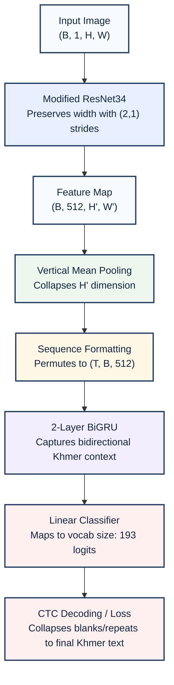

# Model Architecture Diagrams

## Model 1: ResNet34 + BiGRU + CTC

```mermaid
flowchart TD
    A["Input Image<br/>(B, 1, H, W)"] --> B["Modified ResNet34<br/>Preserves width with (2,1) strides"]
    B --> C["Feature Map<br/>(B, 512, H', W')"]
    C --> D["Vertical Mean Pooling<br/>Collapses H' dimension"]
    D --> E["Sequence Formatting<br/>Permutes to (T, B, 512)"]
    E --> F["2-Layer BiGRU<br/>Captures bidirectional Khmer context"]
    F --> G["Linear Classifier<br/>Maps to vocab size: 193 logits"]
    G --> H["CTC Decoding / Loss<br/>Collapses blanks/repeats to final Khmer text"]

    classDef input fill:#f7fbff,stroke:#1f3b63,stroke-width:2px,color:#10233f;
    classDef cnn fill:#e8f0ff,stroke:#1f3b63,stroke-width:2px,color:#10233f;
    classDef pool fill:#edf7ed,stroke:#1f3b63,stroke-width:2px,color:#10233f;
    classDef seq fill:#fff7e6,stroke:#1f3b63,stroke-width:2px,color:#10233f;
    classDef rnn fill:#f3eefe,stroke:#1f3b63,stroke-width:2px,color:#10233f;
    classDef out fill:#fff0f0,stroke:#1f3b63,stroke-width:2px,color:#10233f;

    class A,C input;
    class B cnn;
    class D pool;
    class E seq;
    class F rnn;
    class G,H out;
```

## Model 2: ResNet18 + BiGRU + CTC

```mermaid
flowchart TD
    A["Input Image<br/>(B, 1, H, W)"] --> B["Modified ResNet18<br/>Preserves width with (2,1) strides"]
    B --> C["Feature Map<br/>(B, 512, H', W')"]
    C --> D["Vertical Mean Pooling<br/>Collapses H' dimension"]
    D --> E["Sequence Formatting<br/>Permutes to (T, B, 512)"]
    E --> F["2-Layer BiGRU<br/>Captures bidirectional Khmer context"]
    F --> G["Linear Classifier<br/>Maps to vocab size: 193 logits"]
    G --> H["CTC Decoding / Loss<br/>Collapses blanks/repeats to final Khmer text"]

    classDef input fill:#f7fbff,stroke:#1f3b63,stroke-width:2px,color:#10233f;
    classDef cnn fill:#e8f0ff,stroke:#1f3b63,stroke-width:2px,color:#10233f;
    classDef pool fill:#edf7ed,stroke:#1f3b63,stroke-width:2px,color:#10233f;
    classDef seq fill:#fff7e6,stroke:#1f3b63,stroke-width:2px,color:#10233f;
    classDef rnn fill:#f3eefe,stroke:#1f3b63,stroke-width:2px,color:#10233f;
    classDef out fill:#fff0f0,stroke:#1f3b63,stroke-width:2px,color:#10233f;

    class A,C input;
    class B cnn;
    class D pool;
    class E seq;
    class F rnn;
    class G,H out;
```
